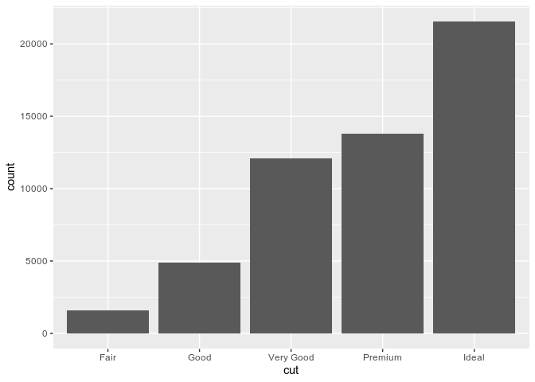

Getting Started: Diamonds
================
(Your name here)
2020-

  - [Grading Rubric](#grading-rubric)
      - [Individual](#individual)
      - [Team](#team)
      - [Due Date](#due-date)
  - [Data Exploration](#data-exploration)
  - [Communication](#communication)

*Purpose*: Throughout this course, you’ll complete a large number of
*exercises* and *challenges*. Exercises are meant to introduce content
with easy-to-solve problems, while challenges are meant to make you
think more deeply about and apply the content. The challenges will start
out highly-scaffolded, and become progressively open-ended.

In this challenge, you will go through the process of exploring,
documenting, and sharing an analysis of a dataset. We will use these
skills again and again in each challenge.

<!-- include-rubric -->

# Grading Rubric

<!-- -------------------------------------------------- -->

Unlike exercises, **challenges will be graded**. The following rubrics
define how you will be graded, both on an individual and team basis.

## Individual

<!-- ------------------------- -->

| Category    | Unsatisfactory                                                                   | Satisfactory                                                               |
| ----------- | -------------------------------------------------------------------------------- | -------------------------------------------------------------------------- |
| Effort      | Some task **q**’s left unattempted                                               | All task **q**’s attempted                                                 |
| Observed    | Did not document observations                                                    | Documented observations based on analysis                                  |
| Supported   | Some observations not supported by analysis                                      | All observations supported by analysis (table, graph, etc.)                |
| Code Styled | Violations of the [style guide](https://style.tidyverse.org/) hinder readability | Code sufficiently close to the [style guide](https://style.tidyverse.org/) |

## Team

<!-- ------------------------- -->

| Category   | Unsatisfactory                                                                                   | Satisfactory                                       |
| ---------- | ------------------------------------------------------------------------------------------------ | -------------------------------------------------- |
| Documented | No team contributions to Wiki                                                                    | Team contributed to Wiki                           |
| Referenced | No team references in Wiki                                                                       | At least one reference in Wiki to member report(s) |
| Relevant   | References unrelated to assertion, or difficult to find related analysis based on reference text | Reference text clearly points to relevant analysis |

## Due Date

<!-- ------------------------- -->

All the deliverables stated in the rubrics above are due on the day of
the class discussion of that exercise. See the
[Syllabus](https://docs.google.com/document/d/1jJTh2DH8nVJd2eyMMoyNGroReo0BKcJrz1eONi3rPSc/edit?usp=sharing)
for more information.

``` r
library(tidyverse)
```

    ## ── Attaching packages ──────────────────────────────────────────────────────────────────────────────────────────── tidyverse 1.3.0 ──

    ## ✓ ggplot2 3.3.2     ✓ purrr   0.3.4
    ## ✓ tibble  3.0.1     ✓ dplyr   1.0.0
    ## ✓ tidyr   1.1.0     ✓ stringr 1.4.0
    ## ✓ readr   1.3.1     ✓ forcats 0.5.0

    ## ── Conflicts ─────────────────────────────────────────────────────────────────────────────────────────────── tidyverse_conflicts() ──
    ## x dplyr::filter() masks stats::filter()
    ## x dplyr::lag()    masks stats::lag()

# Data Exploration

<!-- -------------------------------------------------- -->

In this first stage, you will explore the `diamonds` dataset and
document your observations.

**q1** Create a plot of `price` vs `carat` of the `diamonds` dataset
below. Document your observations from the visual.

*Hint*: We learned how to do this in `e-vis00-basics`\!

``` r
## TASK: Plot `price` vs `carat` below
## Your code here!

ggplot(data= diamonds) + geom_smooth(mapping = aes(y = price, x = carat))
```

    ## `geom_smooth()` using method = 'gam' and formula 'y ~ s(x, bs = "cs")'

<!-- -->
**Observations**: This plot shows that up to \~2.5 carats, higher carat
correlates with higher price. Beyond 2.5 carats the correlation
generally still applies, but there is a ‘valley’ in between 2.5 and 3.5
carats. I will further examine a histogram to see if if data is sparse
beyond 2.5 carats as I suspect.

``` r
ggplot(data = diamonds, aes(carat)) + geom_histogram(binwidth = 0.02)
```

<!-- -->

``` r
ggplot(data = diamonds, aes(carat)) + geom_histogram(binwidth = 0.3)
```

<!-- -->

***Observations*** These two histograms provide very different
information. - smaller binning shows that some sizes are much more
common than others - larger binning show that smaller diamonds are much
more common than larger diamonds. This makes sense as diamonds are often
used in rings and very large rings are undesirable

**q2** Create a visualization showing variables `carat`, `price`, and
`cut` simultaneously. Experiment with which variable you assign to which
aesthetic (`x`, `y`, etc.) to find an effective visual.

``` r
## TASK: Plot `price`, `carat`, and `cut` below
## Your code here!
ggplot(data=diamonds) + 
  geom_smooth(mapping = aes(x = carat, y = price, color = cut))
```

    ## `geom_smooth()` using method = 'gam' and formula 'y ~ s(x, bs = "cs")'

<!-- -->

**Observations**:

  - Seems like the strange price dip is because there are not high
    quality diamonds that exist at large carats.
  - Generally, at a given carat, higher quality diamonds are more
    expensive.

**Further plots**

I was also interested in seeing what the average carat was for each size
of diamond.

``` r
ggplot(data=filter(diamonds)) + geom_boxplot(mapping = aes(x = cut, y = carat),
                                             outlier.shape = NA)
```

<!-- -->

Generally, the higher the quality, the smaller the average diamond of
that quality.

I was also curious how many of each diamond type there were.

``` r
ggplot(data = diamonds, aes(cut)) + 
  geom_bar() +
  scale_fill_brewer(palette= "Dark2")
```

<!-- -->

It seems that there are many more high quality diamonds than low quality
diamonds.

# Communication

<!-- -------------------------------------------------- -->

In this next stage, you will render your data exploration, push it to
GitHub to share with others, and link your observations within our [Data
Science
Wiki](https://olin-data-science.fandom.com/wiki/Olin_Data_Science_Wiki).

**q3** *Knit* your document in order to create a report.

You can do this by clicking the “Knit” button at the top of your
document in RStudio.


This will create a local `.md` file, and RStudio will automatically open
a preview window so you can view your knitted document.

**q4** *Push* your knitted document to GitHub.


You will need to stage both the `.md` file, as well as the `_files`
folder. Note that the `_files` folder, when staged, will expand to
include all the files under that directory.


**q5** *Document* your findings in our
[Wiki](https://olin-data-science.fandom.com/wiki/Olin_Data_Science_Wiki).
Work with your learning team to come to consensus on your findings.

The [Datasets](https://olin-data-science.fandom.com/wiki/Datasets) page
contains lists all the datasets we’ve analyzed together.

**q6** *Prepare* to present your team’s findings\!

**q7** Add a link to your personal data-science repository on the
[Repositories](https://olin-data-science.fandom.com/wiki/Repositories)
page. Make sure to file it under your team name\!
