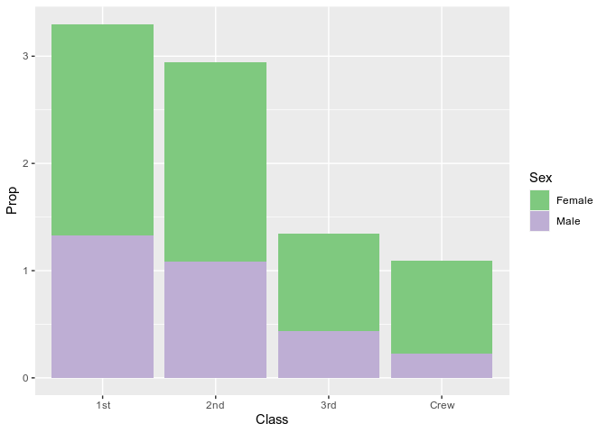

RMS Titanic
================
L Little
2020-07

  - [Grading Rubric](#grading-rubric)
      - [Individual](#individual)
      - [Team](#team)
      - [Due Date](#due-date)
  - [First Look](#first-look)
  - [Deeper Look](#deeper-look)
  - [Notes](#notes)

*Purpose*: Most datasets have at least a few variables. Part of our task
in analyzing a dataset is to understand trends as they vary across these
different variables. Unless we’re careful and thorough, we can easily
miss these patterns. In this challenge you’ll analyze a dataset with a
small number of categorical variables and try to find differences among
the groups.

*Reading*: (Optional) [Wikipedia
article](https://en.wikipedia.org/wiki/RMS_Titanic) on the RMS Titanic.

<!-- include-rubric -->

# Grading Rubric

<!-- -------------------------------------------------- -->

Unlike exercises, **challenges will be graded**. The following rubrics
define how you will be graded, both on an individual and team basis.

## Individual

<!-- ------------------------- -->

| Category    | Unsatisfactory                                                                   | Satisfactory                                                               |
| ----------- | -------------------------------------------------------------------------------- | -------------------------------------------------------------------------- |
| Effort      | Some task **q**’s left unattempted                                               | All task **q**’s attempted                                                 |
| Observed    | Did not document observations                                                    | Documented observations based on analysis                                  |
| Supported   | Some observations not supported by analysis                                      | All observations supported by analysis (table, graph, etc.)                |
| Code Styled | Violations of the [style guide](https://style.tidyverse.org/) hinder readability | Code sufficiently close to the [style guide](https://style.tidyverse.org/) |

## Team

<!-- ------------------------- -->

| Category   | Unsatisfactory                                                                                   | Satisfactory                                       |
| ---------- | ------------------------------------------------------------------------------------------------ | -------------------------------------------------- |
| Documented | No team contributions to Wiki                                                                    | Team contributed to Wiki                           |
| Referenced | No team references in Wiki                                                                       | At least one reference in Wiki to member report(s) |
| Relevant   | References unrelated to assertion, or difficult to find related analysis based on reference text | Reference text clearly points to relevant analysis |

## Due Date

<!-- ------------------------- -->

All the deliverables stated in the rubrics above are due on the day of
the class discussion of that exercise. See the
[Syllabus](https://docs.google.com/document/d/1jJTh2DH8nVJd2eyMMoyNGroReo0BKcJrz1eONi3rPSc/edit?usp=sharing)
for more information.

``` r
library(tidyverse)
```

    ## ── Attaching packages ────────────────────── tidyverse 1.3.0 ──

    ## ✓ ggplot2 3.3.2     ✓ purrr   0.3.4
    ## ✓ tibble  3.0.1     ✓ dplyr   1.0.0
    ## ✓ tidyr   1.1.0     ✓ stringr 1.4.0
    ## ✓ readr   1.3.1     ✓ forcats 0.5.0

    ## ── Conflicts ───────────────────────── tidyverse_conflicts() ──
    ## x dplyr::filter() masks stats::filter()
    ## x dplyr::lag()    masks stats::lag()

``` r
df_titanic <- as_tibble(Titanic)
```

*Background*: The RMS Titanic sank on its maiden voyage in 1912; about
67% of its passengers died.

# First Look

<!-- -------------------------------------------------- -->

**q1** Perform a glimpse of `df_titanic`. What variables are in this
dataset?

``` r
## TASK: Perform a `glimpse` of df_titanic
glimpse(df_titanic)
```

    ## Rows: 32
    ## Columns: 5
    ## $ Class    <chr> "1st", "2nd", "3rd", "Crew", "1st", "2nd", "3rd", "Crew", "1…
    ## $ Sex      <chr> "Male", "Male", "Male", "Male", "Female", "Female", "Female"…
    ## $ Age      <chr> "Child", "Child", "Child", "Child", "Child", "Child", "Child…
    ## $ Survived <chr> "No", "No", "No", "No", "No", "No", "No", "No", "No", "No", …
    ## $ n        <dbl> 0, 0, 35, 0, 0, 0, 17, 0, 118, 154, 387, 670, 4, 13, 89, 3, …

**Observations**:

Variables are:

  - Class
  - Sex
  - Age
  - survived
  - number (n)

**q2** Skim the [Wikipedia
article](https://en.wikipedia.org/wiki/RMS_Titanic) on the RMS Titanic,
and look for a total count of passengers. Compare against the total
computed below. Are there any differences? Are those differences large
or small? What might account for those differences?

``` r
## NOTE: No need to edit! We'll cover how to
## do this calculation in a later exercise.
df_titanic %>% summarize(total = sum(n))
```

    ## # A tibble: 1 x 1
    ##   total
    ##   <dbl>
    ## 1  2201

**Observations**:

  - According to wikipeda, there were 3327 total people, so this
    database seems to be missing \~1000 passengers, almost 1/3 of the
    total.
  - Perhaps this data was collected differently - for example passenger
    manifest instead of sold tickets.

**q3** Create a plot showing the count of passengers who *did* survive,
along with aesthetics for `Class` and `Sex`. Document your observations
below.

*Note*: There are many ways to do this.

``` r
## TASK: Visualize counts against `Class` and `Sex`
df_titanic %>%
  filter(Survived == 'Yes' & Age == 'Adult') %>%
  ggplot() +
  geom_col(aes(x = Class, y = n, fill = Sex), position = 'dodge') + 
  scale_fill_brewer(palette= "Accent")
```

<!-- -->

**Observations**:

I will only consider Adults here, to be consistent with q4 (explained in
q4)

  - Out of everyone who survived, most of them were either Crew or 1st
    class
  - Many more 1st and 2nd class women survived than 1st and 2nd class
    men
  - Many more male crew survived then female crew
  - An equal number of 3rd class men and women survived.

# Deeper Look

<!-- -------------------------------------------------- -->

Raw counts give us a sense of totals, but they are not as useful for
understanding differences between groups. This is because the
differences we see in counts could be due to either the relative size of
the group OR differences in outcomes for those groups. To make
comparisons between groups, we should also consider *proportions*.\[1\]

The following code computes proportions within each `Class, Sex, Age`
group.

``` r
## NOTE: No need to edit! We'll cover how to
## do this calculation in a later exercise.
df_prop <-
  df_titanic %>%
  group_by(Class, Sex, Age) %>%
  mutate(
    Total = sum(n),
    Prop = n / Total
  ) %>%
  ungroup()
df_prop
```

    ## # A tibble: 32 x 7
    ##    Class Sex    Age   Survived     n Total    Prop
    ##    <chr> <chr>  <chr> <chr>    <dbl> <dbl>   <dbl>
    ##  1 1st   Male   Child No           0     5   0    
    ##  2 2nd   Male   Child No           0    11   0    
    ##  3 3rd   Male   Child No          35    48   0.729
    ##  4 Crew  Male   Child No           0     0 NaN    
    ##  5 1st   Female Child No           0     1   0    
    ##  6 2nd   Female Child No           0    13   0    
    ##  7 3rd   Female Child No          17    31   0.548
    ##  8 Crew  Female Child No           0     0 NaN    
    ##  9 1st   Male   Adult No         118   175   0.674
    ## 10 2nd   Male   Adult No         154   168   0.917
    ## # … with 22 more rows

**q4** Replicate your visual from q3, but display `Prop` in place of
`n`. Document your observations, and note any new/different observations
you make in comparison with q3.

``` r
df_prop %>%
  filter(Survived == 'Yes') %>%
  ggplot() +
  geom_col(aes(x = Class, y = Prop, fill = Sex), position = 'stack') + 
  scale_fill_brewer(palette= "Accent")
```

    ## Warning: Removed 2 rows containing missing values (position_stack).

<!-- -->

**Observations**:

  - This graph doesn’t make any sense unless I ALSO facet/filter by age
    or make a new group\_by() proportion that doesn’t consider age. The
    geom\_col() function is just adding together proportions in a
    nonsensical way since there are multiple proportion values for each
    Sex and Class group (it is adding the proprtion of Children and
    Adults who survived in each Age and Class). Therefore for this
    quesiton I will only consider adults.

  - Related note - while it makes sense to use a ‘stack’ visualization
    for a total count, it generally does not make sense to use for
    proportions since you cannot just add proportions together in the
    same way.

  - It is also weird that when I change the code to position = ‘dodge’
    instead it seems like the bars cut off at 1 for no reason? Why is
    that? (shown below)

<!-- end list -->

``` r
df_prop %>%
  filter(Survived == 'Yes') %>%
  ggplot() +
  geom_col(aes(x = Class, y = Prop, fill = Sex), position = 'dodge')  + 
  scale_fill_brewer(palette= "Accent")
```

    ## Warning: Removed 2 rows containing missing values (geom_col).

<!-- -->

Ok now for the graph with only ’Adult’s considered

``` r
df_prop %>%
  filter(Survived == 'Yes' & Age == 'Adult') %>%
  ggplot() +
  geom_col(aes(x = Class, y = Prop, fill = Sex), position = 'dodge')  + 
  scale_fill_brewer(palette= "Accent")
```

<!-- -->
**Observations**

  - Even though many fewer female crew survived total, female crew
    members survived at a much higher proportion than male crew members.
  - Overall, women of any given class were twice as likely to survive as
    men of the same class.
  - The group where any given member was most likely to survive was 1st
    class women
  - The group where any given member was least likely to survive was 2nd
    class men
  - For women, higher class led to being more likely to survive. Not so
    with men.
  - Fewer than 1/3 of the total men survived. **q5** Create a plot
    showing the group-proportion of passengers who *did* survive, along
    with aesthetics for `Class`, `Sex`, *and* `Age`. Document your
    observations below.

*Hint*: Don’t forget that you can use `facet_grid` to help consider
additional variables\!

``` r
df_prop %>%
  filter(Survived == 'Yes') %>%
  ggplot() +
  geom_col(aes(x = Class, y = Prop, fill = Sex), position = 'dodge') +
  facet_grid("Age") + 
  scale_fill_brewer(palette= "Accent")
```

    ## Warning: Removed 2 rows containing missing values (geom_col).

<!-- -->

**Observations**:

  - Children in general were much more likely to survive
  - All of the 1st and 2nd class children survived.
  - 3rd class children survived in about the same proportion as 3rd
    class adults
  - There were no childern on the crew (not surprising).

# Notes

<!-- -------------------------------------------------- -->

\[1\] This is basically the same idea as [Dimensional
Analysis](https://en.wikipedia.org/wiki/Dimensional_analysis); computing
proportions is akin to non-dimensionalizing a quantity.
